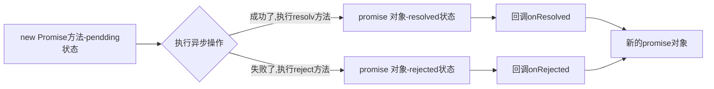

<div style="width: 100%; font-size: 16px; color:#d4226a;  background: #f5bebe;  padding: 15px; border-radius: 4px; ">
你不必等到非常厉害，才敢开始;    你需要开始，才会变得非常厉害 。🤔️ 🤔️ 🤔️
</div>

🎈 如有补充或问题请提issues 🎏  我会及时回复~ <br />
🎈 将会持续更新，给个Star 🌟 再走吧~ 

***

### 🧚‍♀️ 前置知识了解

> N1:  区别实例对象和函数对象

- 函数对象： 将函数作为对象使用时，称为函数对象。
- 实例对象：new 函数产生的对象，简称对象。

```javascript
function Fn() {} // Fn函数
const fn = new Fn() // Fn是构造函数 fn是实例对象
Fn.prototype // Fn是函数对象
```

> N2: 两种类型的回调函数

- 特性：我定义的  不是我亲自调用的

- 同步回调函数

	含义：立即执行，完全执行完了才结束，不会放入回调队列中 <br />
	举个🌰 ： `数组遍历相关的回调函数` `Promise的excutor函数`

- 异步回调函数

	含义： 会放入回调队列中执行  <br />
	举个🌰 ：`定时器回调`  `ajax回调`  ` Promise成功｜失败的回调`

> N3: 进一步理解JS的Error 及 Error处理 （阅读mdn文档）

- 常见的内置错误类型
	1. Error: 所有错误的父类
	2. RefrenceError: 应用的变量不存在
	3. TypeError： 数据类型不正确
	4. RangeError： 数据值不在其所允许的范围内
	5. SyntaxError: 语法错误

- 错误处理
	1. 捕获错误： try ... catch
	2. 抛出错误： throw error
```javascript
// 捕获异常
try {
	let a; 
  console.log(a.xxxx)
} catch(error) {
  console.log(error.message, error.stack)
}
		
// 抛出异常
function something() {
  if(Date.now()%2 === 1) {
    console.log('oook')
  } else {
    // 如果不满足条件抛出异常， 由调用来处理
    throw new Error('oooh no')
  }
}
try {
  something()
} catch (error) {
  console.log(error)
}	
```

- 错误对象
	1. message: 错误相关信息
	2. stack：函数调用栈记录信息

### 🍭  正文开始

> Q1: Promise 是什么
- 抽象表单： Promise是JS中进行异步编程的新的解决方案。(旧的：回调函数，事件监听， 发布订阅)
- 具象表单： 从语法上说， Promise是一个构造函数； 从功能上说，Promise对象用来封装一个异步操作并可以获取其结果。

> Q2: Promise的状态改变

- pending 变为 resolved
- pending 变为 rejected

 <div style="font-size: 14px; color:rgb(0, 124, 255);  background: #f5bebe;  padding: 5px; border-radius: 4px;"> 
🍰 只有这两种，且一个promise对象职能改变一次，无论变成成功还是失败，都会有一个结果数据。   
成功的结果一般称为value， 失败的结果数据一般称为reason。
</div>


> Q3: Promise的基本流程





> Q4: Promise的基本使用
```javascript
// 1. 创建一个新的Promise对象
const miao = new Promise((resolve, reject) => { // 执行器函数(excutor)
  // 2. 执行异步操作任务
  setTimeout(() => {
    const timer = Date.now() 
    // 3.1 如果成功了，调用resolve(value)
    if(timer % 2 == 0) {
      resolve('成功的数据， timer=' + timer)
    }else {
      //3.2 如果失败了，调用reject(reason)
      reject('失败的数据， timer=' + timer)
    }
  }, 1000)
})

miao.then(
  value => { // 接收得到成功的value数据  onResolved
    console.log('成功 /的回调', value)
  },
  reason => { // 接受得到失败的reason数据 onRejected
    console.log('失败的回调', reason)
  }
)
```

> Q5: 为什么要使用Promise

> Promise的并发限制

> Q3: Promise的异常捕获

> Q4: Promis如何实现then处理

> Q5: Promise.all的使用， 实现原理及错误处理

> Q6: 设计并实现Promise.race

> Q7: 模拟实现一个Promise.finally

> Q8: 手写一个Promise  使用class 手写一个promise

>Q9:  Promise 中reject 和 catch 处理上有什么区别

- reject 是用来抛出异常，catch 是用来处理异常
- reject 是 Promise 的方法，而 catch 是 Promise 实例的方法
- reject后的东西，一定会进入then中的第二个回调，如果then中没有写第二个回调，则进入catch
网络异常（比如断网），会直接进入catch而不会进入then的第二个回调

